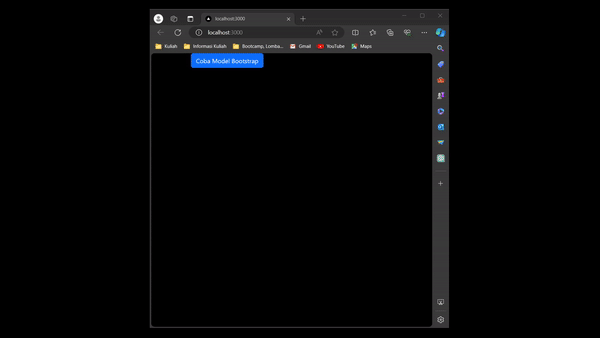

This is a [Next.js](https://nextjs.org/) project bootstrapped with [`create-next-app`](https://github.com/vercel/next.js/tree/canary/packages/create-next-app).

## Getting Started

First, run the development server:

```bash
npm run dev
# or
yarn dev
# or
pnpm dev
# or
bun dev
```

Open [http://localhost:3000](http://localhost:3000) with your browser to see the result.

You can start editing the page by modifying `pages/index.tsx`. The page auto-updates as you edit the file.

[API routes](https://nextjs.org/docs/api-routes/introduction) can be accessed on [http://localhost:3000/api/hello](http://localhost:3000/api/hello). This endpoint can be edited in `pages/api/hello.ts`.

The `pages/api` directory is mapped to `/api/*`. Files in this directory are treated as [API routes](https://nextjs.org/docs/api-routes/introduction) instead of React pages.

This project uses [`next/font`](https://nextjs.org/docs/basic-features/font-optimization) to automatically optimize and load Inter, a custom Google Font.

# **Laporan Praktikum**

|  | Pemrograman Berbasis Framework 2024 |
|--|--|
| NIM | 2141720004 |
| Nama | Alya Marliza Koesnanto |
| Kelas | TI - 3A |
| | |

* ## **Jawaban Soal/Praktikum 1**
>Yang terjadi dari pemrograman diatas ialah adanya tombol **"Coba model bootstrap"** yang dimana jika kita klik akan muncul sebuah _pop-up_ berisikan pesan seperti gambar berformat gif dibawah ini.

